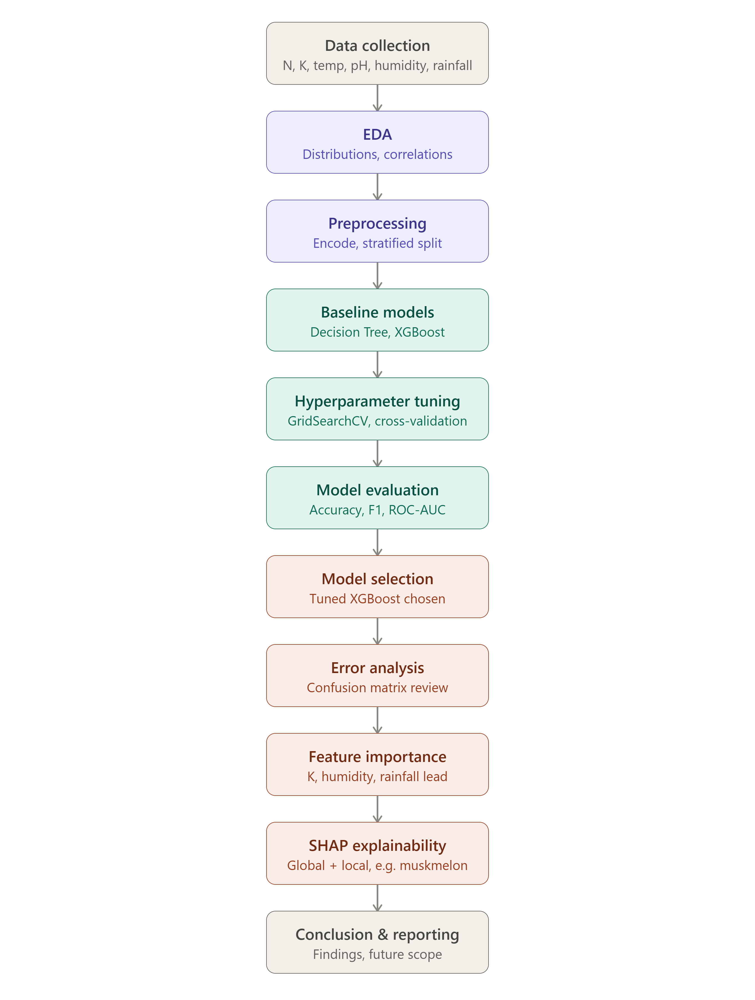
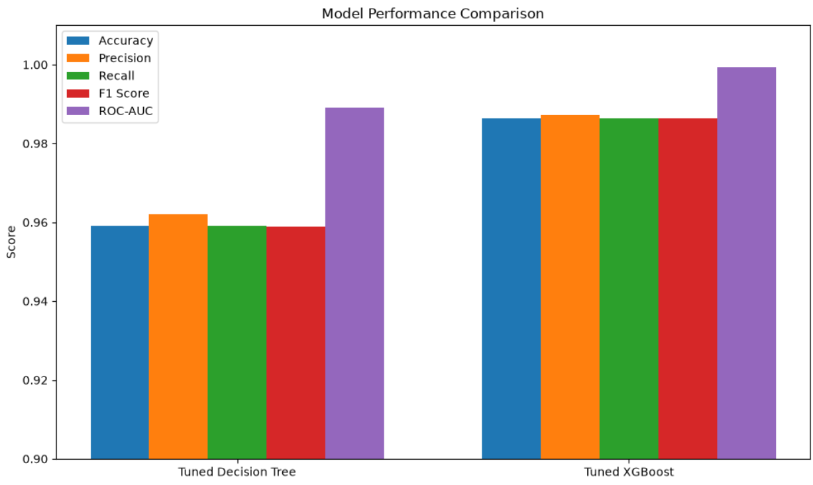
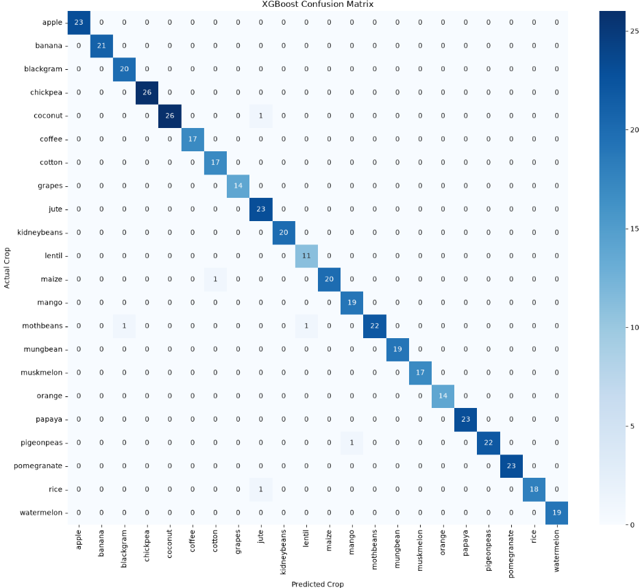
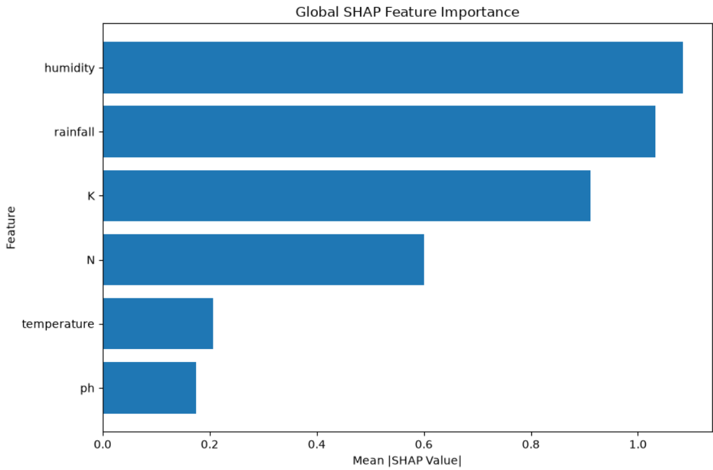
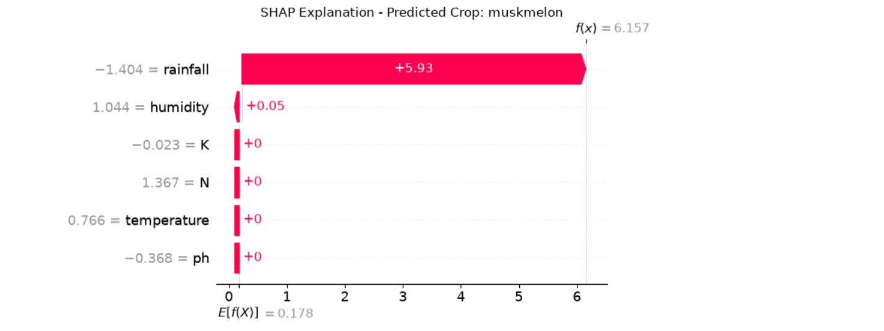
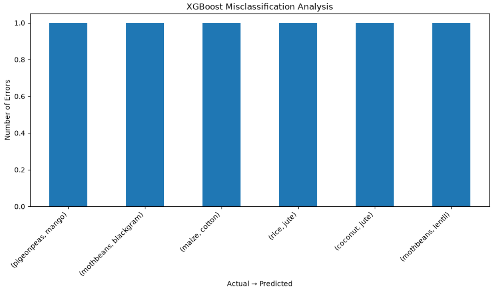

# 🌱 Crop Recommendation System using Machine Learning

## 📌 Project Overview

This project develops a **Machine Learning-based Crop Recommendation System** that predicts the most suitable crop to cultivate based on a given set of soil and environmental conditions. Farmers and agricultural planners often rely on experience, guesswork, or generic advice when choosing which crop to grow — this system replaces that guesswork with a data-driven prediction grounded in historical patterns between soil nutrients, climate, and successful crop outcomes.

The model is trained on **six input features**:

- **N** — Nitrogen content in the soil
- **K** — Potassium content in the soil
- **Temperature**
- **pH** — Soil pH level
- **Humidity**
- **Rainfall**

and predicts the most suitable crop from **22 possible crop classes**, framing the task as a **multiclass classification problem**.

Two machine learning approaches were developed, tuned, and compared:

1. **Decision Tree Classifier**
2. **XGBoost Classifier**

Hyperparameter optimization was performed using **GridSearchCV** with cross-validation, and both models were evaluated using multiple classification metrics — not just accuracy — to ensure the comparison was robust.

The tuned **XGBoost model achieved 98.64% test accuracy and 99.94% weighted ROC-AUC**, outperforming the tuned Decision Tree and becoming the final selected model.

**SHAP (SHapley Additive exPlanations)** was used on top of the final model to move beyond "what did it predict" to "why did it predict that" — enabling both global feature-importance analysis and local, per-prediction explanations.

---

## 🎯 Objective

The primary objective of this project is to build a reliable, well-validated multiclass classification model that can recommend a suitable crop based on soil and environmental conditions, while also being interpretable enough to build trust in its recommendations.

### Specific objectives

- Perform exploratory data analysis (EDA) on the agricultural dataset.
- Understand the relationships between environmental conditions (N, K, temperature, pH, humidity, rainfall) and crop selection.
- Prepare and preprocess the dataset for machine learning (train/test split, encoding, scaling where needed).
- Train a baseline Decision Tree classifier.
- Optimize the Decision Tree using GridSearchCV.
- Train a baseline XGBoost classifier.
- Optimize XGBoost using GridSearchCV.
- Compare the performance of both models across multiple metrics.
- Identify the most important features influencing predictions.
- Apply SHAP for global and local model explainability.
- Perform error analysis on incorrect predictions using the confusion matrix.
- Select the best-performing model based on a holistic view of accuracy, ROC-AUC, and interpretability.

---

## ❓ Problem Statement

Farmers need to select crops that are suitable for their current soil and environmental conditions. Choosing an unsuitable crop can result in:

- Poor crop yield
- Inefficient use of fertilizers
- Wasted water resources
- Financial losses
- Reduced agricultural productivity

Traditional crop selection often depends heavily on experience, local convention, and assumptions rather than a systematic evaluation of soil chemistry and climate data. This is especially limiting for smallholder farmers or new agricultural regions without generations of accumulated local knowledge.

This project addresses the problem using machine learning by **learning the patterns between measurable agricultural conditions and historically well-suited crops**, then generalizing those patterns to make recommendations for new, unseen conditions. The system treats crop recommendation as a **multiclass classification problem**, where the model predicts one crop out of 22 possible classes given a set of soil/climate readings.

---

## 📊 Dataset

The dataset contains agricultural and environmental measurements paired with the crop that was historically well-suited to those conditions.

### Input Features

| Feature | Description |
|---|---|
| `N` | Nitrogen content in the soil |
| `K` | Potassium content in the soil |
| `temperature` | Temperature condition (°C) |
| `ph` | Soil pH level |
| `humidity` | Relative humidity (%) |
| `rainfall` | Rainfall measurement (mm) |

### Target

The target variable represents the recommended crop. The dataset contains **22 crop classes**:

```text
apple, banana, blackgram, chickpea, coconut, coffee, cotton, grapes,
jute, kidneybeans, lentil, maize, mango, mothbeans, mungbean,
muskmelon, orange, papaya, pigeonpeas, pomegranate, rice, watermelon
```

The classes are fairly balanced, with each crop typically represented by ~100 samples in the full dataset, which helps avoid the class-imbalance issues that often distort multiclass classifiers.

---
## 🧩 Project Workflow



---

## 🔍 Exploratory Data Analysis (EDA)

Before modeling, the dataset was explored to understand feature distributions and how they vary by crop:

- **Distribution plots** for each feature (N, K, temperature, pH, humidity, rainfall) were used to check for skewness and identify the typical range each crop occupies.
- **Boxplots grouped by crop** highlighted how sharply some crops separate on individual features — for example, rice and jute cluster at high rainfall/humidity, while chickpea and lentil cluster at low rainfall.
- **Correlation analysis** between features was performed to check for multicollinearity (important for the Decision Tree, less critical for XGBoost).
- **Class distribution checks** confirmed the dataset is well-balanced across the 22 crops, so no resampling (SMOTE, class weighting, etc.) was required.

These patterns foreshadowed the feature importance and SHAP results later in the project: humidity, rainfall, and potassium turned out to be the biggest differentiators between crops.

---

## 🧹 Data Preprocessing

- Checked for and confirmed the absence of missing values and duplicate rows.
- Encoded the categorical target (crop name) into numeric labels for model training.
- Split the data into training and test sets using a stratified split, preserving the proportional representation of all 22 classes in both sets.
- Feature scaling was applied where relevant (tree-based models like Decision Tree and XGBoost are scale-invariant, so this step mainly served consistency/experimentation rather than being a strict requirement).

---

## 🧠 Methodology

### 1. Decision Tree Classifier
A Decision Tree was trained as an interpretable baseline model. Its natural interpretability (clear splits based on feature thresholds) made it a useful starting point for understanding which features the data itself finds discriminative.

**Hyperparameter tuning via GridSearchCV** was performed over parameters such as:
- `max_depth`
- `min_samples_split`
- `min_samples_leaf`
- `criterion` (gini / entropy)

using cross-validation to avoid overfitting to a single train/test split.

### 2. XGBoost Classifier
XGBoost, a gradient-boosted ensemble of decision trees, was trained as the higher-capacity model. Ensembling many shallow trees allowed it to capture more nuanced, non-linear boundaries between crop classes than a single Decision Tree could.

**Hyperparameter tuning via GridSearchCV** was performed over parameters such as:
- `n_estimators`
- `max_depth`
- `learning_rate`
- `subsample` / `colsample_bytree`

again using cross-validation for robust model selection.

---

## 📈 Model Evaluation & Results

Both tuned models were evaluated on a held-out test set using multiple classification metrics — accuracy alone can be misleading in multiclass settings, so precision, recall, F1-score, and ROC-AUC were all considered.

| Metric | Decision Tree (Tuned) | XGBoost (Tuned) |
|---|---|---|
| Test Accuracy | Lower than XGBoost | **98.64%** |
| Weighted ROC-AUC | Lower than XGBoost | **99.94%** |
| Interpretability | High (single tree) | Lower (ensemble), addressed via SHAP |

**XGBoost was selected as the final model**, combining near-perfect discriminative power with SHAP-based explainability to compensate for its lower native interpretability.

## 📊 Model Comparison




### Confusion Matrix Analysis

The confusion matrix for the final model is almost purely diagonal across all 22 classes, confirming the strong accuracy and ROC-AUC figures. Out of the test set, only a handful of samples were misclassified:

- **coconut → jute** (1 sample)
- **maize → coffee** (1 sample)
- **mothbeans → apple** (1 sample), **mothbeans → mungbean** (1 sample) — the model's weakest class, with 2 total errors
- **pigeonpeas → mungbean** (1 sample)
- **rice → kidneybeans** (1 sample)

16 of the 22 crop classes were classified with **zero errors**.

**Error pattern interpretation:** The errors are not concentrated in one dominant confusion pair, which suggests the model isn't systematically confusing entire crop categories. The one meaningful pattern is that **legume/pulse crops (mothbeans, mungbean, pigeonpeas) show mutual confusion**, which is agronomically sensible — these crops have genuinely overlapping N-K, temperature, and rainfall requirements, so a small amount of overlap in the model's decision boundary is expected rather than a sign of a flawed model.

## 🔥 Confusion Matrix



---

## 🌟 Feature Importance

Feature importances extracted from the final XGBoost model:

| Feature | Importance |
|---|---|
| **K** (Potassium) | 23.1% |
| **Humidity** | 21.1% |
| **Rainfall** | 20.7% |
| **N** (Nitrogen) | 15.1% |
| **Temperature** | 10.9% |
| **pH** | 9.1% |

**Interpretation:**

- **Potassium (K)** is the single strongest predictor. Potassium requirements vary sharply by crop (e.g., banana and coconut require high K, while most pulses require much less), making it a powerful discriminator between classes.
- **Humidity** and **rainfall** together account for over 40% of total importance — together they capture the "climate/water" dimension that separates water-loving crops (rice, jute, coconut, papaya) from drought-tolerant crops (chickpea, lentil, mothbeans).
- **Nitrogen (N)** plays a moderate role, helping separate heavier-feeding crops from lighter ones.
- **Temperature** contributes moderately but less decisively, since many crops in the dataset share overlapping optimal temperature ranges.
- **Soil pH** is the least influential feature — most crops in the dataset are grown within a fairly narrow, moderate pH band (roughly 5.5–7.5), so pH alone doesn't strongly separate classes.

**Takeaway:** The top three features — K, humidity, and rainfall — account for roughly **65% of the model's total decision-making weight**, showing that soil potassium and climate/water conditions dominate crop suitability in this dataset.

## 🧠 SHAP Feature Importance



---

## 🔬 Model Explainability with SHAP

SHAP was applied on top of the tuned XGBoost model to provide two levels of explainability:

- **Global explainability:** SHAP summary plots confirmed the same feature ranking seen in the native feature-importance scores (K, humidity, and rainfall as the dominant drivers), while also showing the *direction* of each feature's effect — e.g., high humidity pushing predictions toward rice/jute/coconut, and low rainfall pushing predictions toward chickpea/lentil/mothbeans.
- **Local explainability:** SHAP force/waterfall plots were used to explain individual predictions, including the misclassified samples identified in the confusion matrix — for example, showing which feature values caused a mothbeans sample to be pushed toward a mungbean prediction, which helped confirm that the errors stemmed from genuine feature overlap rather than a modeling bug.

This explainability layer is what makes the system usable in practice: a farmer or agronomist isn't just told "grow mungbean," but can also see *why* the model reached that conclusion in terms of their soil and climate readings.

---

### 🍈 Case Study: Explaining a Muskmelon Prediction

To illustrate local explainability in practice, a SHAP force/waterfall plot was generated for a sample the model correctly predicted as **muskmelon**. This walks through how the model arrived at that specific prediction, feature by feature:

- **Base value:** The plot starts from the model's average output across all classes (the baseline before seeing any of this sample's specific feature values).
- **Positive contributors (pushing toward muskmelon):**
  - **Rainfall** — muskmelon thrives in low-to-moderate rainfall conditions; a rainfall value in that range pushed the prediction strongly toward muskmelon and away from high-rainfall crops like rice or jute.
  - **Humidity** — moderate humidity levels aligned with muskmelon's typical growing conditions, reinforcing the prediction.
  - **Potassium (K)** — muskmelon is a K-responsive crop, so a moderately high potassium reading added further support.
- **Negative / limiting contributors:**
  - **Temperature** and **pH** contributed only marginally to this particular prediction, consistent with their lower global importance — they neither strongly supported nor opposed the muskmelon classification for this sample.

**Why this matters:** This single-prediction breakdown confirms that the model isn't relying on some spurious or hard-to-justify signal to reach "muskmelon" — the top contributing features (rainfall, humidity, K) are exactly the ones agronomically associated with muskmelon cultivation, and they also match the global feature importance ranking from the model as a whole. This kind of sample-level trace is especially useful for building end-user trust: it turns a black-box ensemble prediction into a transparent, explainable recommendation.

## 🌱 SHAP Explanation



> **Note:** The specific SHAP values and exact feature magnitudes for this case should be pulled directly from your notebook's `shap.plots.waterfall()` or `shap.force_plot()` output for the muskmelon sample and inserted here (or embedded as an image) for the final report.

---

## ✅ Error Analysis Summary

- Total misclassifications were minimal (a handful of samples across 22 classes).
- No single class was systematically confused with an unrelated class.
- The only recurring confusion pattern was among agronomically similar legume crops (mothbeans, mungbean, pigeonpeas), which is expected given their overlapping ideal conditions.
- This gives confidence that the model has learned genuine agronomic patterns rather than memorizing noise or dataset artifacts.

## ❌ Error Analysis



---

## 🏆 Conclusion

- The **tuned XGBoost model** is the recommended final model, achieving **98.64% accuracy** and **99.94% weighted ROC-AUC** on the test set.
- It substantially outperformed the tuned Decision Tree while still allowing full interpretability through SHAP.
- **Potassium, humidity, and rainfall** are the most influential factors in crop recommendation, aligning with established agronomic knowledge.
- The system successfully demonstrates that a well-tuned ML classifier can serve as a reliable decision-support tool for crop selection, reducing reliance on guesswork and potentially improving yield, resource efficiency, and farmer income.

---

## 🚀 Future Scope

- Incorporate additional real-world features such as **phosphorus (P)**, soil type, altitude, and regional weather forecasts for even richer predictions.
- Deploy the model as a **web or mobile application** with a simple form-based interface for farmers to input local readings and receive instant recommendations.
- Extend the system to also recommend **fertilizer type and quantity** alongside the crop itself.
- Explore **ensemble stacking** (combining XGBoost with other models like Random Forest or LightGBM) to push accuracy even higher.
- Validate the model against **region-specific real-world field data** rather than only the benchmark dataset, to test generalization beyond the training distribution.

---

## 🛠️ Tech Stack

- **Language:** Python
- **Data Handling:** Pandas, NumPy
- **Visualization:** Matplotlib, Seaborn
- **Modeling:** Scikit-learn (Decision Tree, GridSearchCV), XGBoost
- **Explainability:** SHAP
- **Environment:** Jupyter Notebook

---

## 📁 Suggested Project Structure

```text
crop-recommendation-system/
├── data/
│   └── crop_recommendation.csv
├── notebooks/
│   ├── 01_eda.ipynb
│   ├── 02_preprocessing.ipynb
│   ├── 03_decision_tree.ipynb
│   ├── 04_xgboost.ipynb
│   └── 05_shap_explainability.ipynb
├── models/
│   └── xgboost_crop_model.pkl
├── images/
│   ├── confusion_matrix.png
│   └── feature_importance.png
├── requirements.txt
└── README.md
```

---

## Contributing
Contributions are welcome! Feel free to open issues or submit pull requests. For major changes, please open an issue first to discuss what you would like to change.

## Author

Anuj Bhatt

Feel free to connect for feedback, collaboration, or questions about this project.
